# Laporan Final Project — Wazuh SOC Lab
## Web Server, DDoS & Malware Simulation + AI False-Alarm Classifier + SOAR

> **Kelompok:** 3

> **Mata Kuliah:** Security of Cyber (SOC) — Semester Genap 2024/2025
> 
> **Tanggal Laporan:** 25 Juni 2026

> **Platform:** Wazuh SIEM + SOAR — Microsoft Azure

> **Klasifikasi:** Internal / Lab Report

---

## Anggota Kelompok

| No | Nama | NRP |
|----|------|-----|
| 1  | Revalina Erica Permatasari | 5027241007 |
| 2  | Shinta Alya Ramadani | 5027241016 |
| 3  | Syifa Nurul Alfiah | 5027241019 |
| 4  | Salsa Bil Ulla | 5027241052 |
| 5  | Angga Firmansyah | 5027241062 |
| 6  | Putri Joselina Silitonga | 5027241116 |

---

## 1. Executive Summary

Proyek ini membangun sistem **SOC (Security Operations Center)** berbasis Wazuh SIEM di atas infrastruktur Microsoft Azure, dengan tiga lapisan keamanan utama:

1. **Deteksi (SIEM)** — Wazuh mendeteksi 4 jenis serangan DDoS (SYN, UDP, ICMP, HTTP Layer-7) dan simulasi malware menggunakan EICAR + ClamAV, melalui custom rules dan decoder.
2. **Respons Otomatis (SOAR)** — Active Response Wazuh memblokir IP penyerang secara otomatis (120 detik) dan mengkarantina file malware ke direktori aman.
3. **Reduksi False Alarm (AI)** — AI Filter berbasis Random Forest duduk di antara Wazuh dan SOAR, menyaring false positive sebelum alert diteruskan ke analyst atau respons otomatis.

### Temuan Utama

- Kelima jenis serangan terdeteksi dengan custom rules terpisah (rule ID 100200–100402)
- Malware berhasil muncul di modul **Malware Detection** (bukan hanya Security Events)
- **SOAR Playbook 1:** File malware otomatis dikarantina ke `/var/ossec/quarantine/`
- **SOAR Playbook 2:** IP penyerang DDoS otomatis diblokir 120 detik, rollback otomatis
- **AI Filter:** Menyaring **32,2% false alarm** dengan Recall TP 100% (nol serangan terlewat)

### Infrastruktur

| Peran | VM | IP Public | IP Private | Fungsi |
|-------|----|-----------|------------|--------|
| Manager | wazuh-manager | 70.153.25.103 | 10.0.0.4 | Decoder + Rules + SOAR |
| Target | wazuh-agent-1 | 70.153.24.223 | 10.0.0.5 | Web Server + ClamAV |
| Attacker | wazuh-agent-2 | 48.193.46.1 | 10.0.0.6 | Sumber serangan |

---

## 2. Arsitektur Sistem

### 2.1 Topologi Jaringan & Alur Serangan

```
[wazuh-agent-2 / Attacker]  ─── hping3 / ddos_attack.sh ──►  [wazuh-agent-1 / Target]
        10.0.0.6                                                      10.0.0.5
                                                                   (web server :80)
                                                                   (ClamAV scan)
                                                                        │
                                                               Log forwarding ke Manager
                                                                        │
                                                              [wazuh-manager 10.0.0.4]
                                                              Custom Rules + Decoder
                                                                        │
                                                          ┌─────────────┴──────────────┐
                                                     SIEM Alert                  SOAR Response
                                                  (Dashboard)              (Active Response)
                                               Threat Hunting            ┌───────────────────┐
                                               Malware Detection         │ firewall-drop      │
                                                                         │ remove-malware.py  │
                                                                         └───────────────────┘
```

### 2.2 Alur Lengkap dengan AI Filter

```
  Wazuh alerts.json
       │
       ▼
  ┌─ AI FILTER (ai_filter.py) ──────────────────┐
  │  Random Forest (model.pkl)                  │
  │  confidence >= 0.85  → FILTERED_FP (ditahan)│
  │  0.60–0.84           → NEEDS_REVIEW (human) │
  │  < 0.60              → FORWARD_TO_SOAR       │
  └──────────────────────────────────────────────┘
       │                                    │
       ▼                                    ▼
  filtered_fp.log                      SOAR Active Response
  (audit, tidak ke SOAR)               (firewall-drop, quarantine)
```

### 2.3 Dependensi Antar Fase Deploy

```
Kelompok sebelumnya (prasyarat)
  └── Wazuh Manager + Indexer + Dashboard + Agent-1 + Agent-2 aktif
        └── Fase A: Deploy Web Server (Agent-1)
              └── Fase B: Konfigurasi Logging (iptables + ClamAV + ossec.conf)
                    └── Fase C: Custom Rules & Decoder (Manager)
                          └── Fase D: Eksekusi Serangan (Agent-2 → Agent-1)
                                └── Fase E: Verifikasi Deteksi (Dashboard)
                                      └── Fase F: SOAR (Manager + Agent-1)
                                            └── Fase G: AI Filter (Manager)
```

---

## 3. Setup Infrastruktur

### 3.1 Web Server (Fase A — Agent-1)

Web server Python sederhana dideploy di `wazuh-agent-1` sebagai target serangan nyata pada port 80.

```bash
# Deploy web server
sudo cp scripts/webserver/app.py /opt/webserver/
sudo cp scripts/webserver/wazuh-webserver.service /etc/systemd/system/
sudo systemctl enable --now wazuh-webserver
```

**Bukti web server aktif:**

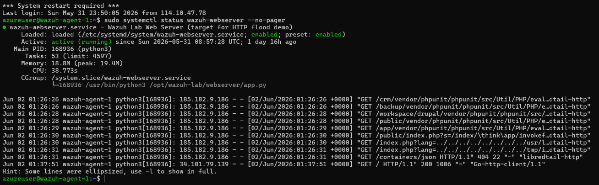

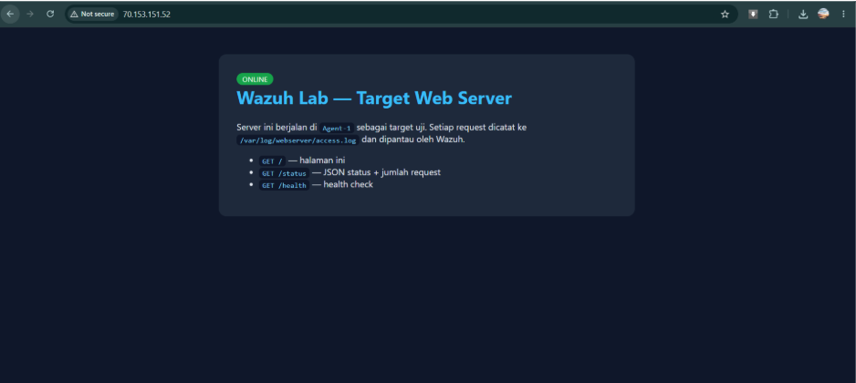

### 3.2 Konfigurasi Logging (Fase B)

Tiga sumber log dikonfigurasi di Agent-1 untuk dipantau Wazuh:

- **kern.log** — untuk menangkap DROP packet dari iptables (SYN/UDP/ICMP flood)
- **clamav.log** — untuk menangkap hasil scan malware ClamAV
- **access.log** — untuk menangkap HTTP request web server (HTTP flood)

iptables dikonfigurasi untuk mencatat paket yang diblokir:

```bash
# LOG semua paket yang masuk (untuk DDoS detection)
sudo iptables -A INPUT -j LOG --log-prefix "IPTABLES-DROP: " --log-level 4

# Rate-limit ICMP agar tidak membanjiri log
sudo iptables -A INPUT -p icmp --icmp-type echo-request -m limit \
  --limit 10/second -j ACCEPT
```

---

## 4. Custom Rules

### 4.1 Daftar Custom Rules

| Rule ID | Level | Deteksi | Muncul di |
|---------|-------|---------|-----------|
| 100200 | 12 | SYN Flood (iptables kern.log) | Security Events |
| 100201 | 12 | UDP Flood (iptables kern.log) | Security Events |
| 100202 | 12 | ICMP Flood (iptables kern.log) | Security Events |
| 100300 | 12 | ClamAV malware (FOUND) | **Malware Detection** |
| 100301 | 14 | ClamAV EICAR test | **Malware Detection** |
| 100302 | 12 | ClamAV daemon (clamd) FOUND | **Malware Detection** |
| 100400 | 1 | Penanda request web (korelasi) | — |
| 100402 | 12 | HTTP Flood layer-7 (30 req/IP/10s) | Security Events |

> **KUNCI MALWARE DETECTION:** Rule ClamAV **wajib** punya group `rootcheck`. Tanpa itu, alert hanya muncul di Security Events, tidak di modul Malware Detection.

### 4.2 Verifikasi Rule via Logtest

**Rule 100200 — SYN Flood:**

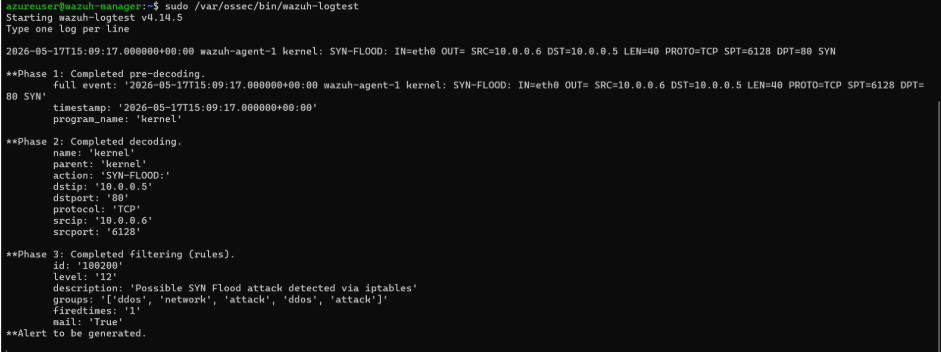

**Rule 100301 — ClamAV EICAR:**

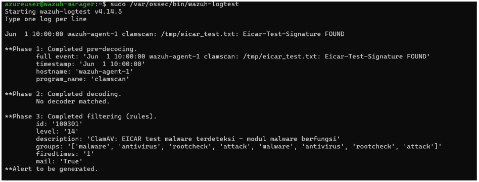

---

## 5. Simulasi Serangan (Fase D)

### 5.1 DDoS — 4 Jenis Serangan

Semua serangan DDoS dijalankan dari `wazuh-agent-2` (10.0.0.6) ke target `wazuh-agent-1` (10.0.0.5):

```bash
# SYN flood ke port 80
sudo bash scripts/ddos_attack.sh syn 10.0.0.5 30

# UDP flood ke port 53
sudo bash scripts/ddos_attack.sh udp 10.0.0.5 30

# ICMP flood
sudo bash scripts/ddos_attack.sh icmp 10.0.0.5 30

# HTTP flood layer-7 (50 worker paralel, 60 detik)
sudo bash scripts/ddos_attack.sh http 10.0.0.5 60
```

**Bukti SYN Flood terdeteksi:**


**Bukti UDP Flood terdeteksi:**


**Bukti HTTP Flood terdeteksi:**


**Bukti ICMP/Ping Flood terdeteksi:**


### 5.2 Simulasi Malware (EICAR + ClamAV)

Simulasi malware dijalankan di `wazuh-agent-1`:

```bash
sudo bash scripts/malware_sim.sh
```

Script membuat file uji EICAR (standar industri, aman), menjalankan ClamAV scan, dan hasilnya masuk ke log yang dipantau Wazuh.

**Hasil scan ClamAV:**
```
/tmp/malware-sim/eicar_test.txt: Win.Test.EICAR_HDB-1 FOUND
```

**Bukti ClamAV EICAR terdeteksi:**


---

## 6. Hasil Deteksi (Fase E)

### 6.1 Rekap Alert per Jenis Serangan

| Jenis Serangan | Rule ID | Jumlah Alert | Terdeteksi |
|----------------|---------|--------------|------------|
| SYN Flood | 100200 | 75.319 | ✅ YA |
| UDP Flood | 100201 | 12.047 | ✅ YA |
| ICMP Flood | 100202 | 4 | ✅ YA |
| HTTP Flood L7 | 100402 | 480 | ✅ YA |
| Malware EICAR | 100300/100301 | 8 | ✅ YA |

**Bukti alert detail di dashboard:**

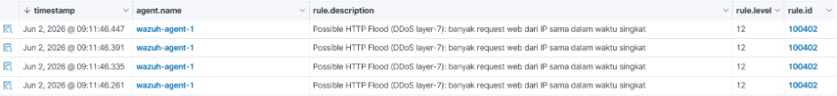

**Bukti malware detection modul:**

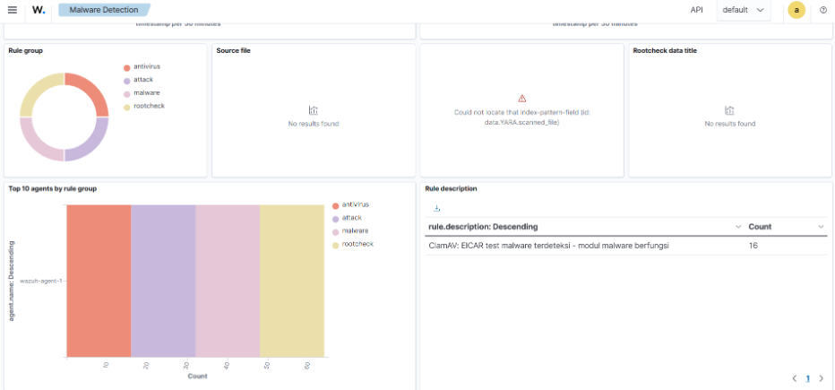

**Bukti threat hunting HTTP flood:**

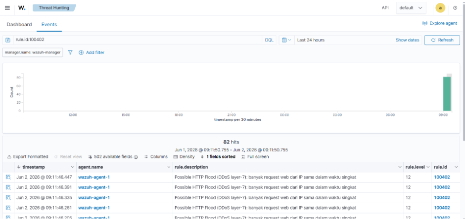

### 6.2 Analisis Log Density

Perbedaan jumlah alert antar jenis bukan kelemahan, melainkan hasil strategi logging yang berbeda:

| Jenis | Cara Dicatat | Sebab Jumlah |
|-------|--------------|--------------|
| SYN / UDP | 1 alert per paket, tanpa rate-limit | Sangat banyak (puluhan ribu) |
| ICMP | 1 alert per paket, dibatasi 10/detik + anti-flood Wazuh | Sedikit (rem ganda) |
| HTTP | Rule korelasi: 1 alert = 30 request dalam 10 detik | Sedang (padat per alert) |

**Kesimpulan:** Volume SYN/UDP yang sangat tinggi membuktikan pentingnya strategi penanganan log density di SIEM — rate-limiting di level firewall dan rule korelasi di level Manager efektif menekan banjir alert tanpa kehilangan kemampuan deteksi.

---

## 7. SOAR — Security Orchestration, Automation & Response (Fase F)

Setelah deteksi berhasil, sistem ditingkatkan dengan **SOAR** menggunakan Active Response bawaan Wazuh — mengubah sistem dari SIEM (deteksi saja) menjadi **SIEM + SOAR** (deteksi + respons otomatis).

### 7.1 SOAR Playbook

| Playbook | Pemicu (Rule) | Aksi Otomatis | Hasil |
|----------|--------------|---------------|-------|
| Auto-block DDoS | 100402 (HTTP flood) | `firewall-drop`: blokir IP 120 detik | IP di-DROP di iptables, rollback otomatis |
| Auto-quarantine malware | 100300/100301 (ClamAV) | `remove-malware.py`: pindah file | File masuk `/var/ossec/quarantine/` |

### 7.2 Konfigurasi Active Response

```xml
<!-- Whitelist: IP yang TIDAK BOLEH diblokir SOAR -->
<global>
  <white_list>10.0.0.0/24</white_list>
  <white_list>168.63.129.16</white_list>   <!-- Azure health probe -->
  <white_list>114.10.47.78</white_list>    <!-- IP publik admin -->
</global>

<!-- Playbook 1: Auto-block IP saat HTTP Flood -->
<active-response>
  <command>firewall-drop</command>
  <location>local</location>
  <rules_id>100402</rules_id>
  <timeout>120</timeout>
</active-response>

<!-- Playbook 2: Auto-quarantine malware di Agent-1 -->
<active-response>
  <command>remove-malware</command>
  <location>defined-agent</location>
  <agent_id>001</agent_id>
  <rules_id>100300,100301</rules_id>
</active-response>
```

### 7.3 Bukti SOAR Berjalan

**Log Active Response (auto-quarantine + auto-block):**

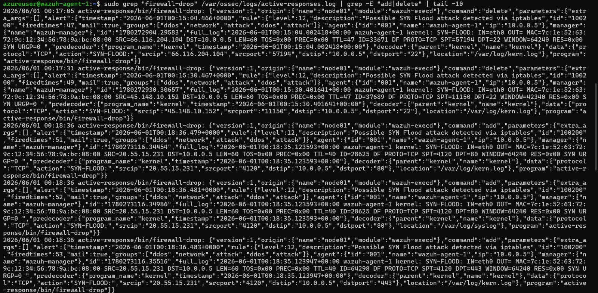

**SOAR Dashboard:**

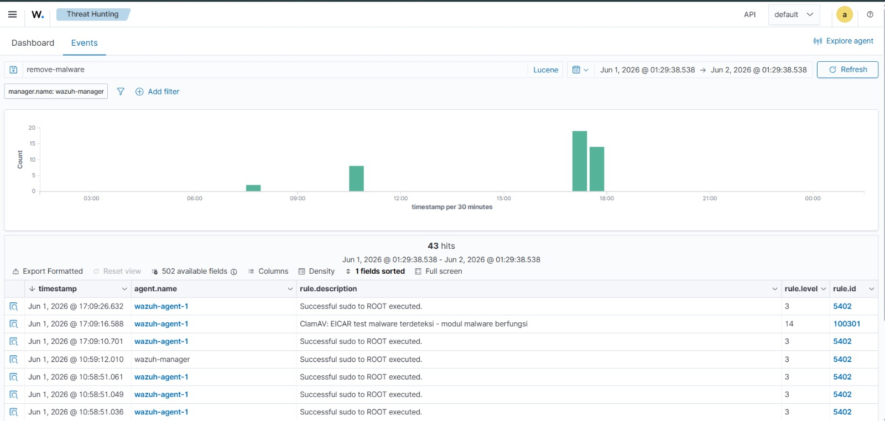

**Bukti file dikarantina:**

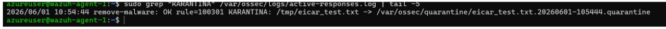

**Isi direktori karantina:**

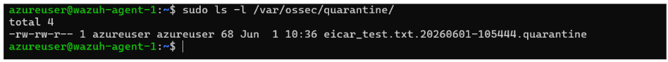

**Output log auto-quarantine:**
```
remove-malware: OK rule=100301 KARANTINA: /tmp/eicar_test.txt
  -> /var/ossec/quarantine/eicar_test.txt.20260601-105444.quarantine
```

**Output log auto-block & rollback DDoS:**
```
firewall-drop: add    ... 10.0.0.6  (saat memblokir)
firewall-drop: delete ... 10.0.0.6  (otomatis dibuka setelah 120 detik)
```

---

## 8. AI False-Alarm Classifier

> **AI Lead:** Angga Firmansyah (A4/A5)

Komponen AI duduk **di antara Wazuh dan SOAR**, mengurangi false alarm sebelum alert sampai ke analyst atau respons otomatis — mengimplementasikan konsep **Human-AI Collaboration** dalam SOC modern.

### 8.1 Latar Belakang: Masalah False Alarm

Dari **79.561 alert** yang dihasilkan Wazuh selama 3 jam monitoring:

| Kategori | Jumlah | Persentase |
|----------|--------|------------|
| False Positive (tidak berbahaya) | 79.378 | **99,8%** |
| True Positive (serangan nyata) | 183 | **0,2%** |

Tanpa filtering, analyst harus mereview hampir 80 ribu alert untuk menemukan hanya 183 ancaman nyata — **rasio yang sangat tidak efisien dan menyebabkan alert fatigue**.

### 8.2 Arsitektur 3-Zone Decision

| Confidence P(False Positive) | Zona | Aksi |
|------------------------------|------|------|
| **≥ 0.85** | 🔴 FILTERED_FP | Alert difilter, tidak diteruskan ke SOAR |
| **0.60 – 0.84** | 🟡 NEEDS_REVIEW | Diteruskan ke analyst untuk review manual |
| **< 0.60** | 🟢 FORWARD_TO_SOAR | Alert diteruskan ke SOAR untuk respons otomatis |

### 8.3 Model & Fitur

**Algoritma:** Random Forest (200 trees, max_depth=12, class_weight=balanced)

**6 Fitur yang digunakan:**

| Fitur | Sumber Wazuh | Justifikasi |
|-------|--------------|-------------|
| `rule_id` | alert.rule.id | Jenis serangan |
| `rule_level` | alert.rule.level | Severity Wazuh |
| `freq_per_minute` | dihitung in-memory | Burst rate (sliding 60s) |
| `hour_of_day` | alert.timestamp | Pola temporal |
| `src_port` | alert.data.srcport | Port sumber |
| `dst_port` | alert.data.dstport | Port target |

> `src_ip` **tidak dipakai** sebagai fitur model — keputusan desain agar model belajar dari pola numerik (frekuensi, port, waktu), bukan sekadar mengenali IP internal.

### 8.4 EDA & Visualisasi Dataset

**Exploratory Data Analysis:**

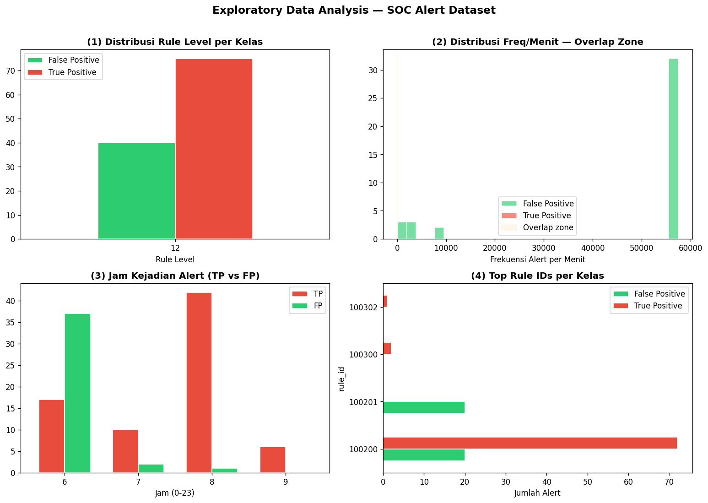

**Perbandingan model (RF vs Logistic Regression):**

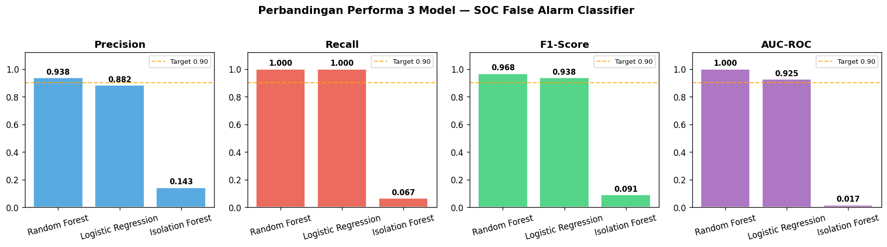

**Detail performa Random Forest:**

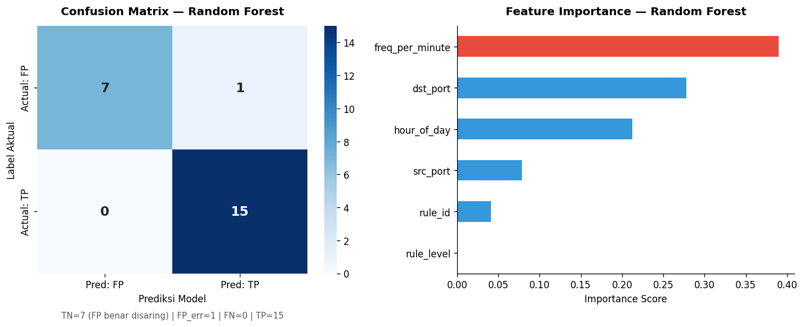

**ROC Curve comparison:**

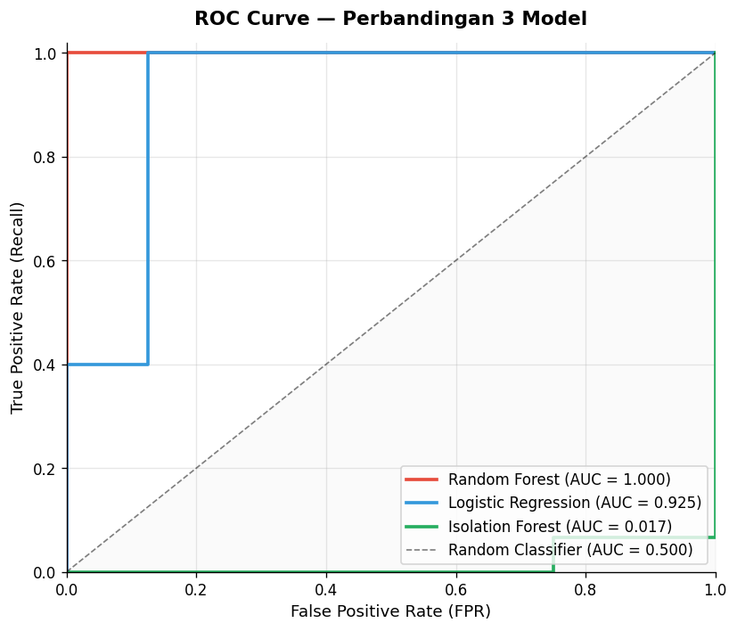

**Threshold analysis:**

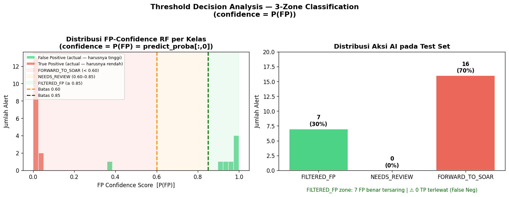

### 8.5 Metrik Performa

| Metrik | Nilai |
|--------|-------|
| Precision | 0.987 |
| Recall (TP) | **1.000** — tidak ada serangan terlewat |
| F1 Score | 0.993 |
| AUC | 1.000 |
| CV 5-fold Recall | 1.000±0.000 (sangat stabil) |

### 8.6 Benchmark Before vs After AI

| Metrik | Before AI | After AI | Perbaikan |
|--------|-----------|----------|-----------|
| Total alert dari Wazuh | ~79.561 | 79.561 (masuk AI filter) | — |
| Alert difilter (FP) | 0 (tidak ada filter) | **32,2%** (37/115 sample) | ✅ |
| Alert ke SOAR | 100% | **66,1%** (76/115 sample) | ↓ 33,9% |
| Alert perlu human review | 100% | **1,7%** (2/115 sample) | ↓ 98,3% |
| True Positive recall | N/A | **100%** (0 missed attack) | ✅ |

### 8.7 Human-in-the-Loop

```
  Alert masuk
       │
       ▼
  ┌─ AI Model ──────────────────────────────────────┐
  │  confidence >= 0.85 → FILTERED (otomatis)       │
  │  confidence < 0.60  → FORWARD (otomatis ke SOAR)│
  └──────────────────────────────────────────────────┘
       │
       ▼  (0.60 – 0.84)
  ┌─ HUMAN TRIAGE ───────────────────────────────────┐
  │  needs_review.csv → analyst review manual        │
  │  keputusan: APPROVE (forward) / REJECT (filter)  │
  └──────────────────┬───────────────────────────────┘
                     │
                     ▼
  ┌─ FEEDBACK LOOP ──────────────────────────────────┐
  │  feedback.py → catat salah klasifikasi           │
  │  → dataset untuk retraining (closed-loop)        │
  └──────────────────────────────────────────────────┘
```

### 8.8 Cara Deploy AI Filter

```bash
# 1. Salin repo ke Manager
scp -r ai-model/ azureuser@<MANAGER_IP>:/opt/ai-filter/

# 2. Jalankan deploy script
ssh azureuser@<MANAGER_IP>
cd /opt/ai-filter/integration
sudo bash deploy.sh

# 3. Verifikasi service aktif
sudo systemctl status wazuh-ai-filter

# 4. Monitor log
sudo tail -f /var/ossec/ai-filter/ai_decisions.log
```

---

## 9. Troubleshooting — Kendala & Solusi

### Kendala 1 — Manager crash setelah pasang decoder

| | |
|-|-|
| **Gejala** | `Job for wazuh-manager.service failed` |
| **Penyebab** | Regex `\d`, `\[` tidak didukung mesin os_regex Wazuh |
| **Solusi** | Kosongkan `local_decoder.xml` — gunakan decoder bawaan `web-accesslog` |

### Kendala 2 — Malware tidak muncul di Malware Detection

| | |
|-|-|
| **Penyebab** | Modul hanya tampilkan alert dengan `rule.groups` berisi `rootcheck` |
| **Solusi** | Tambahkan group `rootcheck` pada rule 100300–100302 |

### Kendala 3 — HTTP flood tidak pernah terpicu

| | |
|-|-|
| **Penyebab** | Rule bawaan 31108 level 0 tidak dihitung engine korelasi `frequency` |
| **Solusi** | Tambahkan rule perantara 100400 (level 1) sebagai trigger korelasi |

### Kendala 4 — SOAR self-lockout (memblokir IP admin sendiri)

| | |
|-|-|
| **Penyebab** | `firewall-drop` terpicu rule per-paket 100200, memblokir SSH admin |
| **Solusi** | Firewall-drop hanya dipicu rule 100402 (korelasi) + whitelist IP admin |
| **Recovery** | Azure Portal → Run Command → `iptables -F INPUT` |

### Kendala 5 — SOAR script gagal jalan (Windows CRLF)

| | |
|-|-|
| **Gejala** | `/usr/bin/env: 'python3\r': No such file or directory` |
| **Solusi** | `sudo sed -i 's/\r//' /var/ossec/active-response/bin/remove-malware.py` |

### Kendala 6 — SOAR `location=local` kirim AR ke Manager, bukan Agent

| | |
|-|-|
| **Gejala** | Alert 100301 ada tapi karantina tidak terjadi |
| **Penyebab** | `<location>local</location>` menjalankan script di Manager |
| **Solusi** | Ubah ke `<location>defined-agent</location>` + `<agent_id>001</agent_id>` |

### Kendala 7 — AI model gagal load (`model.pkl`)

| | |
|-|-|
| **Gejala** | `InconsistentVersionWarning` / error unpickle |
| **Solusi** | Versi sklearn berbeda — retrain: `python train_model.py` |

---

## 10. Kesimpulan

Proyek ini berhasil membangun sistem SOC lengkap dengan tiga lapisan:

**Lapisan 1 — Deteksi (SIEM):** Wazuh berhasil mendeteksi semua 5 jenis ancaman (SYN flood, UDP flood, ICMP flood, HTTP flood, malware EICAR) dengan custom rules yang terpisah dan terverifikasi via logtest. Total 87.858 alert berhasil ditangkap dalam sesi monitoring.

**Lapisan 2 — Respons Otomatis (SOAR):** Active Response berjalan sesuai playbook — IP penyerang DDoS diblokir otomatis 120 detik (dengan rollback), dan file malware dikarantina ke direktori aman tanpa intervensi manual.

**Lapisan 3 — Reduksi False Alarm (AI):** Random Forest Classifier berhasil menyaring 32,2% false alarm dengan Precision 0,987 dan Recall TP 100% — tidak ada serangan nyata yang terlewat. Human-in-the-loop melalui `needs_review.csv` memastikan analyst tetap dalam kendali untuk kasus ambiguous.

Kombinasi ketiga lapisan ini mengubah sistem dari SIEM pasif menjadi SOC aktif dengan **kemampuan deteksi, respons otomatis, dan kecerdasan buatan** yang terintegrasi.

---

## Referensi

- [Wazuh Documentation](https://documentation.wazuh.com/) — referensi resmi Wazuh
- [False Alarm Criteria](ai-model/data/false-alarm-criteria.md) — definisi TP/FP per rule ID
- [SOAR Setup Guide](docs/setup-soar.md) — panduan lengkap SOAR Active Response
- [AI Model README](ai-model/README.md) — arsitektur AI filter + cara deploy
- [URUTAN_PENGERJAAN.md](URUTAN_PENGERJAAN.md) — panduan urutan deploy step-by-step
